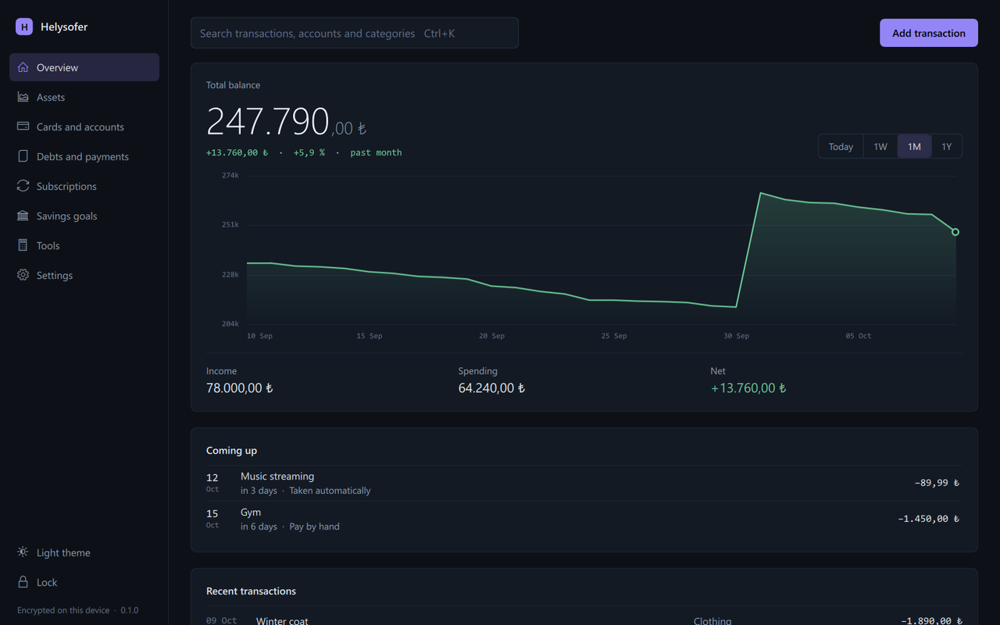
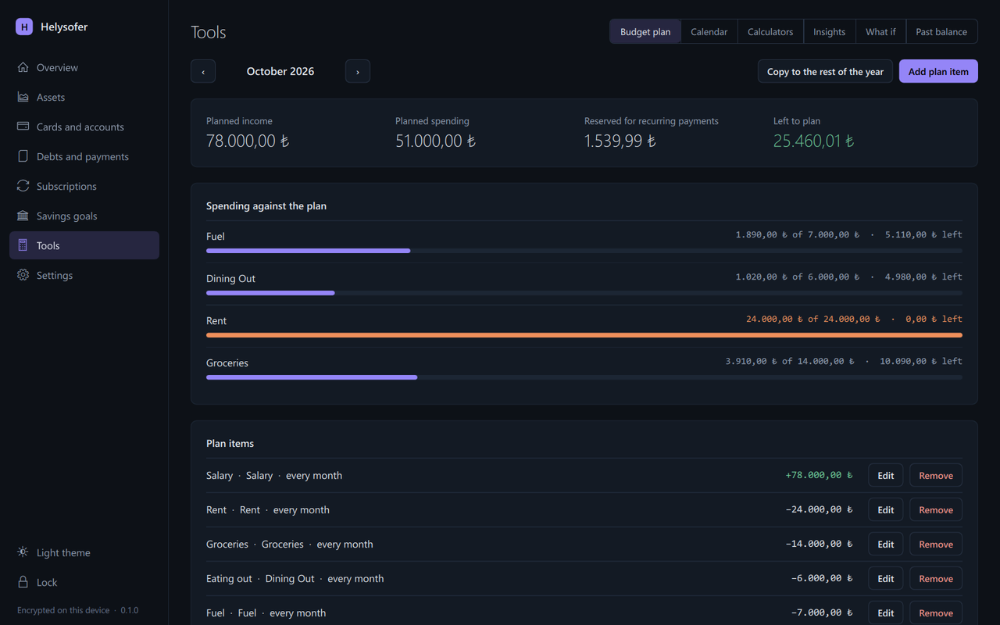

# Helysofer

A privacy-first, local-first desktop workspace for personal finance, cash flow,
and portfolio tracking.

> [!IMPORTANT]
> Helysofer is in development. There is no published release yet: the core
> (data, encryption, backup, pricing, insights) is in place and tested, the
> desktop interface (PySide6 and Qt Quick) covers every section, and a Windows
> package can be built, but nobody except its author has tried it yet. See the
> [roadmap](docs/ROADMAP.md).



| Budget plan | Light theme |
| --- | --- |
|  |  |

## What it covers

- Accounts and credit cards, income and expense transactions.
- Budget planning, savings goals, debts, and recurring payments.
- Portfolio tracking for stocks, precious metals, foreign currencies, and
  cryptocurrencies.
- Subscription detection, balance history, insights, and scenario projections.

## Principles

- **Local-first:** records live in a local SQLite database on your computer.
- **Private:** amount and description fields are encrypted at rest; there are
  no analytics or advertising trackers. Network access is limited to asset
  prices and brand logos.
- **Fail closed:** an unreadable record is never counted as zero. Showing no
  total is safer than showing a false one.

## Running it

There is no download yet. Until the first release, Helysofer runs from source
or from a package you build yourself; both need Windows 10 or later for now.

From source, with Python 3.12:

```bash
python -m pip install -r requirements-runtime.txt
```

```bash
python -m app
```

As a package that needs no Python on the computer it runs on:

```bash
python -m pip install pyinstaller
```

```bash
python scripts/build_windows.py --zip
```

That writes `dist/Helysofer-<version>-windows.zip`. Unpack it anywhere and
start `Helysofer.exe`; keep the `_internal` folder next to it. The program is
not signed, so Windows asks for confirmation the first time: choose
**More info**, then **Run anyway**.

The first start asks for a password and a first account. Records, the
encryption key and settings are kept in your Windows user profile, not next
to the program; **Settings** shows the folder. To move them to another
computer, create a backup in **Settings** and restore it there.

## Repository layout

```text
app/         Desktop interface: Qt Quick views and their controllers
database/    SQLite schema, migrations, connections, and ledger
services/    Domain operations, pricing, insights, projections, backup, recovery
security/    Local authentication, password policy, and login throttling
utils/       Decimal policy, encryption, key storage, paths, logging, formatting
ui/          English text catalog and chart localization
tests/       Unit, integration, security, and recovery tests
scripts/     Audit and benchmark tools
```

## Development

Python 3.12 is the supported version.

```bash
python -m pip install -r requirements.txt
```

```bash
python -m app
```

```bash
python run_tests.py
```

See the [documentation](docs/) for architecture, backup and recovery, and key
management, and [CONTRIBUTING.md](CONTRIBUTING.md) for the workflow.

## Security

Report vulnerabilities as described in [SECURITY.md](SECURITY.md).

## License

Helysofer is available under the [Apache License 2.0](LICENSE); see
[NOTICE](NOTICE).
