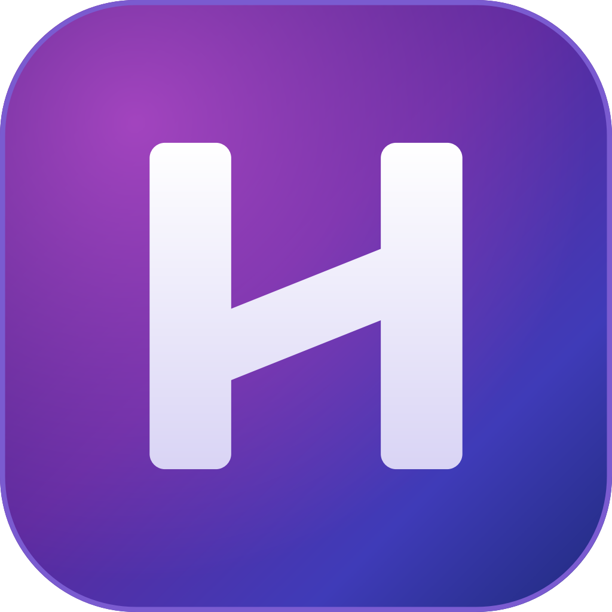
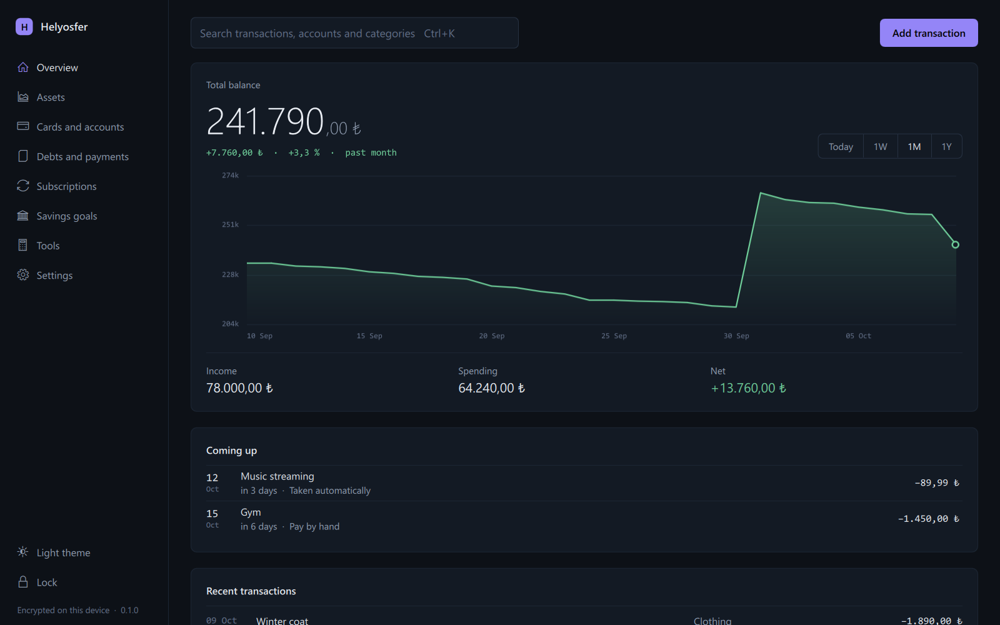
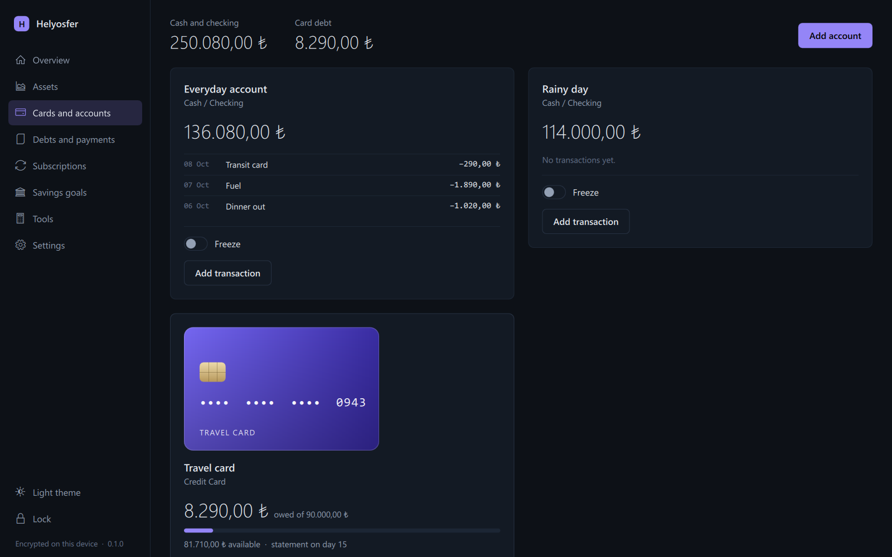
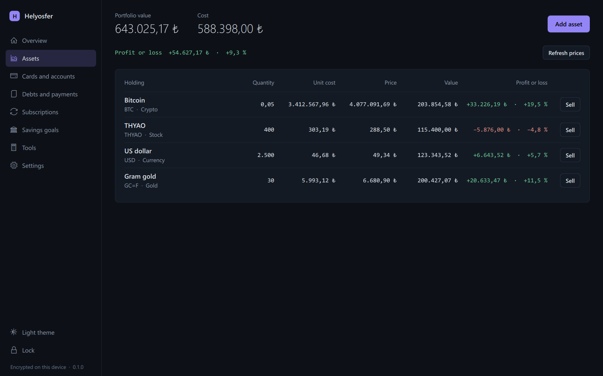
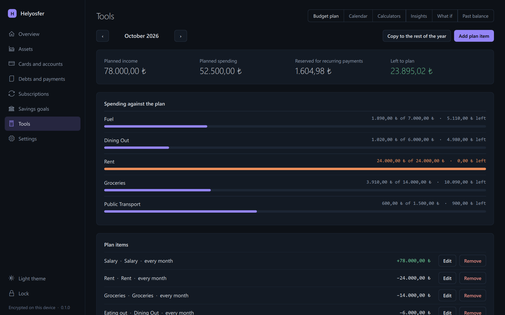
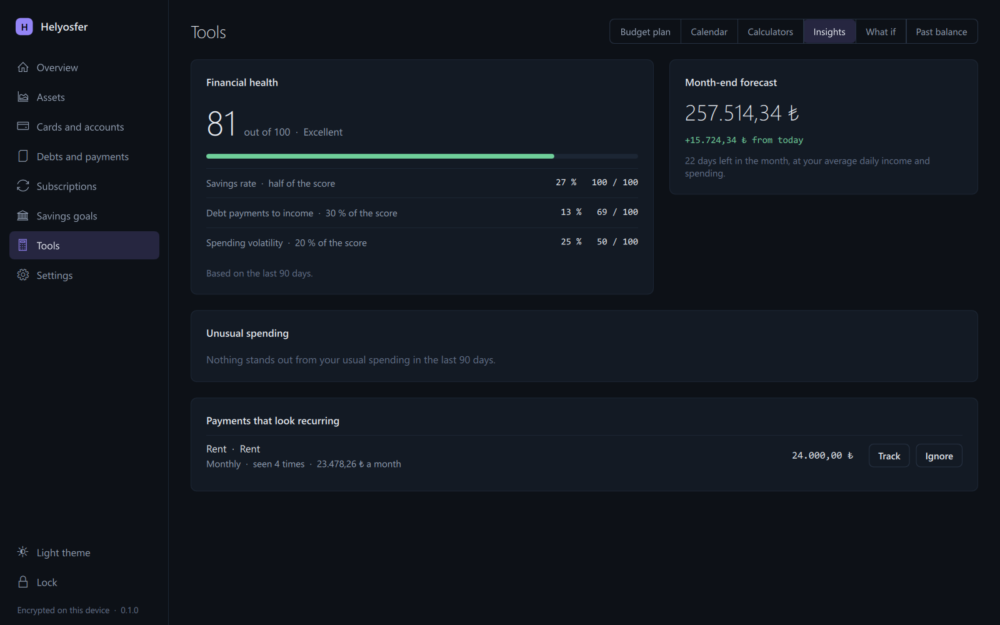
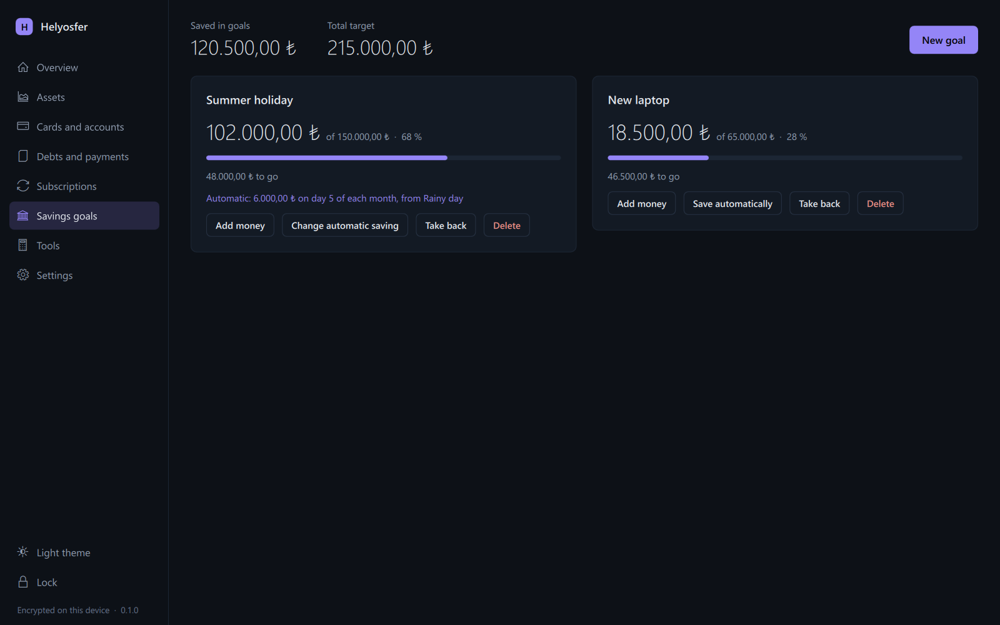
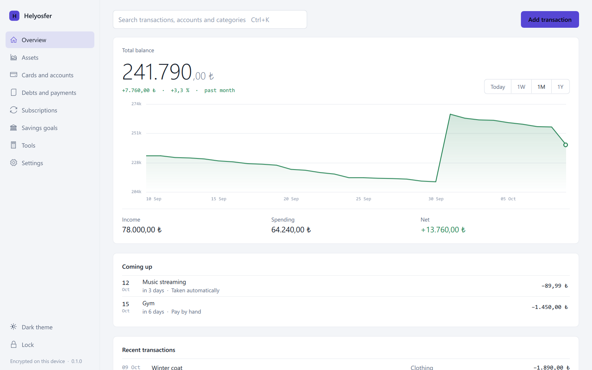

<div align="center">



# Helyosfer

**Your money, on your own computer.**

A private desktop app for accounts, cards, debts, budgets and investments.<br>
No sign-up, no server, nothing to sync. Your records never leave the computer.

**English** · [Türkçe](README.tr.md)

[](https://github.com/Helyosfer/helyosfer-app/actions/workflows/tests.yml)


</div>



> [!NOTE]
> This is the first release, and an early one. Everything described here works
> and is covered by tests, and the setup program has been installed and run on
> two computers. Nobody except its author has used it yet, and not for long:
> keep a backup of anything you would not want to enter twice. The
> [roadmap](docs/ROADMAP.md) says what has and has not been tried.

## What it does

| | |
| --- | --- |
| **Overview** | Your total balance with a chart drawn from the dates of your transactions, what is coming up, what just happened, and one search over everything (<kbd>Ctrl</kbd>+<kbd>K</kbd>). |
| **Cards and accounts** | Cash and checking accounts, and credit cards with a limit, a statement day and a freeze switch. Card debt is paid from an account of yours, and a purchase in installments shows how many the statements have carried. |
| **Debts and payments** | Debts in monthly installments, paid by hand or automatically from the account you choose. A transaction dated in the future waits and applies itself on its day. |
| **Subscriptions** | Recurring payments and income, from weekly to yearly, taken automatically or by hand. Payments that look recurring are noticed and offered for tracking. |
| **Savings goals** | Targets you move money into and out of, with an optional automatic contribution every month. |
| **Assets** | Shares, gold, currencies and crypto at live prices in lira, with the profit or loss of every holding. |
| **Tools** | A monthly budget plan, a calendar, calculators for loans, deposits and growth (with a printable loan schedule), a financial-health score, what-if projections and your balance on any past day. |

## A closer look

| Cards and accounts | Assets |
| --- | --- |
|  |  |
| **Budget plan** | **Insights** |
|  |  |
| **Savings goals** | **Light theme** |
|  |  |

## The details it gets right

- **History follows your dates.** Enter last January's spending today and the
  chart redraws from January. The balance on any day is what the records of
  that day say, not when you typed them in.
- **Nothing is final.** Every record can be changed or removed. A payment or a
  trade the app recorded for you can be undone together with its other half:
  the installments return to the debt, the holding returns to the portfolio.
- **Late is still on time.** Leave it closed for a month and the automatic
  payments, installments and savings contributions you missed are recorded on
  the days they were due.
- **No guessed totals.** A record that cannot be read is never counted as zero.
  Showing no total is safer than showing a wrong one.
- **Yours to shape.** Dark and light themes, English and Turkish, your own
  categories, and animations you can turn off.

## Private by design

- **Local.** Everything is kept in one database in your Windows user profile.
  There is no cloud and no account to create.
- **Encrypted.** Amounts and descriptions are encrypted at rest with
  AES-256-GCM. The key is protected by Windows itself (DPAPI) and is never
  written to disk in the clear.
- **Locked.** The app opens with a password stored only as an Argon2id hash,
  and repeated wrong attempts are slowed down.
- **Portable.** A backup is a single encrypted file with a password of its
  own. Restore it on another computer and carry on.
- **Quiet.** No analytics, no telemetry, no ads. The only thing it asks the
  internet for is the market price of what you hold.

More in [key management](docs/KEY_MANAGEMENT.md),
[backup and recovery](docs/BACKUP_RECOVERY.md) and [SECURITY.md](SECURITY.md).

## Get started

**Download** the setup program from the
[latest release](https://github.com/Helyosfer/helyosfer-app/releases/latest): `Helyosfer-<version>-setup.exe`. It
installs for the current user without administrator rights and needs nothing
else on the computer. Windows 10 or later, 64-bit. A zip of the same program,
which runs from wherever it is unpacked, is there as well.

Neither file is signed, so Windows asks for confirmation the first time:
choose **More info**, then **Run anyway**. The release lists the SHA-256 of
each file for anyone who wants to check a download.

Helyosfer also runs from source, and the same package can be built from it.

**From source**, with Python 3.12:

```bash
python -m pip install -r requirements-runtime.txt
```

```bash
python -m app
```

**As a package** that needs no Python on the computer it runs on:

```bash
python -m pip install pyinstaller
```

```bash
python scripts/build_windows.py --zip
```

That writes `dist/Helyosfer-<version>-windows.zip`. Unpack it anywhere and start
`Helyosfer.exe`, keeping the `_internal` folder next to it.

**As a setup program**, with [Inno Setup 6](https://jrsoftware.org/isinfo.php)
installed as well:

```bash
python scripts/build_windows.py --installer
```

That writes `dist/Helyosfer-<version>-setup.exe`. It installs for the current
user without administrator rights, adds a Start menu entry, and is removed
again from Windows' own list of installed apps. Your records are kept apart
from the program and stay where they are when it is removed or upgraded.

The first start asks for a password and a first account. It opens in Turkish on
a computer set to Turkish and in English everywhere else; **Settings** changes
that at any time. To move to another computer, create a backup in **Settings**
and restore it there.

## Under the hood

Python 3.12, PySide6 with Qt Quick for the interface, and SQLite for the
records. More than a thousand tests run on Linux and Windows for every change,
among them one that plays five months of use, once opening the app daily and
once only now and then, and expects the same books both ways.

```text
app/         The interface: Qt Quick views, their controllers and the Turkish text
database/    SQLite schema, migrations, connections and the balance ledger
services/    What the app does: transactions, pricing, insights, backup, recovery
security/    Sign-in, password policy and login throttling
utils/       Decimal money, encryption, key storage, paths, logging, formatting
ui/          English wording for the messages the services raise
tests/       Unit, integration, security and recovery tests
scripts/     Build, audit and benchmark tools
```

To work on it:

```bash
python -m pip install -r requirements.txt
```

```bash
python run_tests.py
```

The [documentation](docs/) covers the architecture, and
[CONTRIBUTING.md](CONTRIBUTING.md) the workflow.

## License

Helyosfer is available under the [Apache License 2.0](LICENSE); see
[NOTICE](NOTICE).
