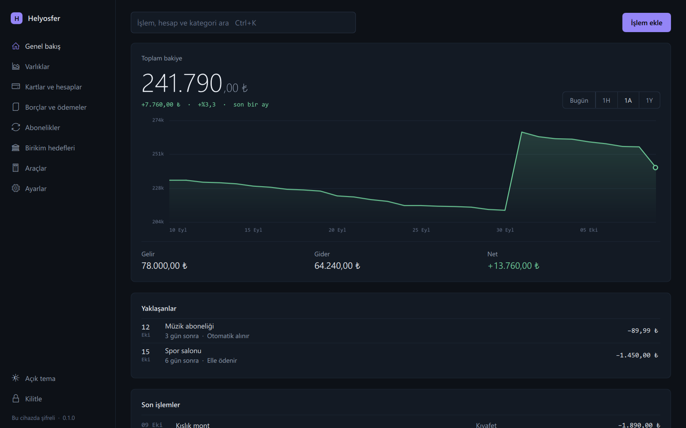
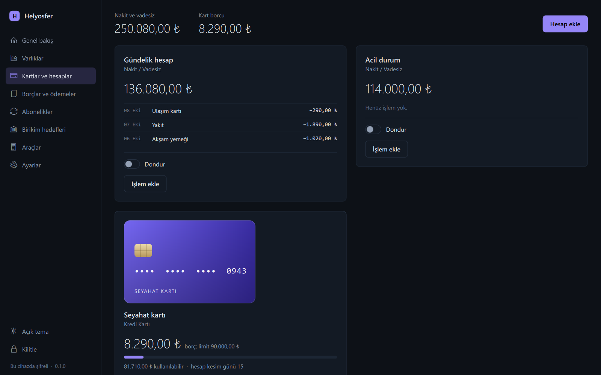
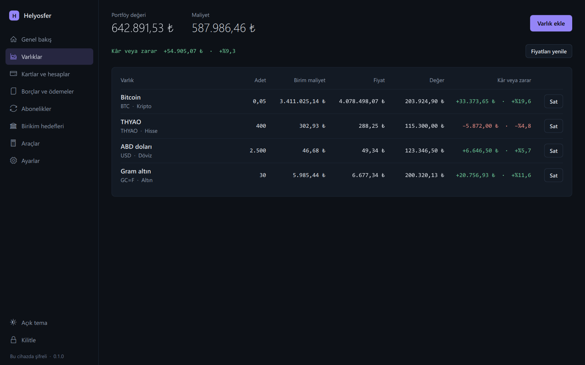
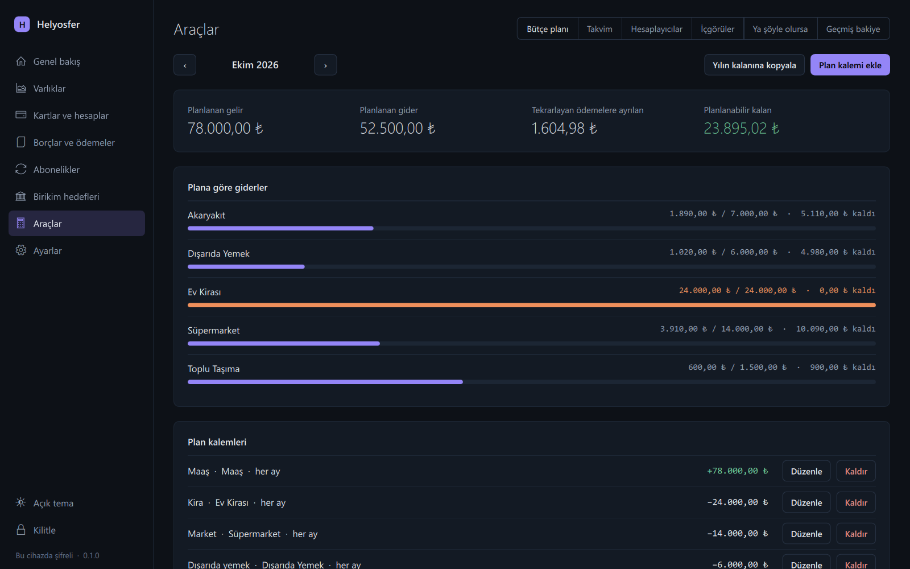
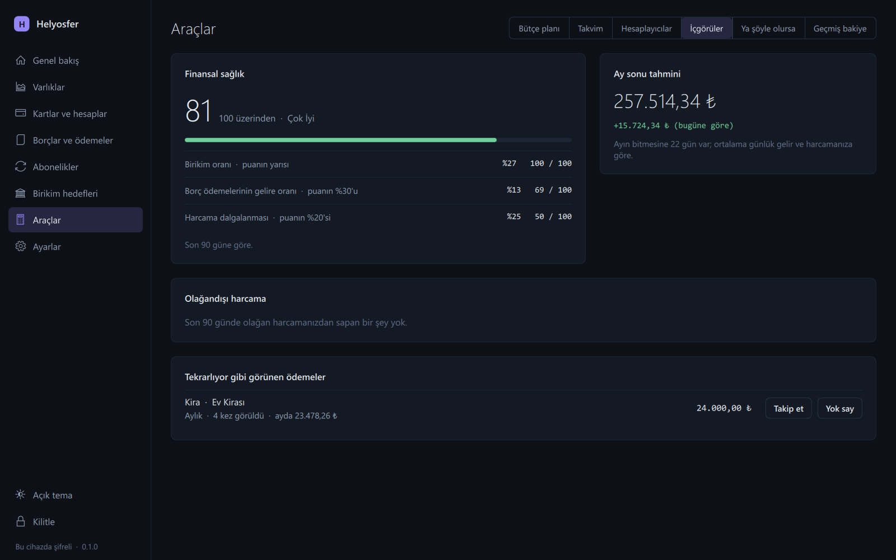
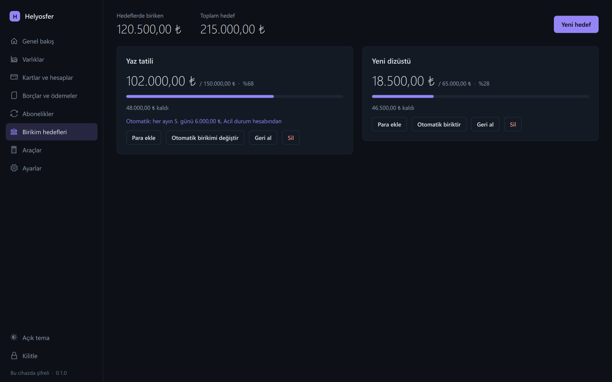
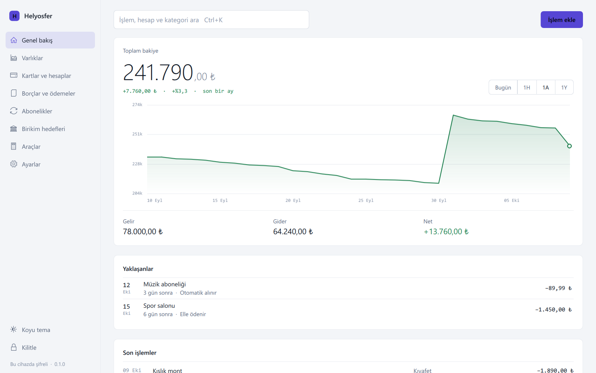

<div align="center">


# Helyosfer

**Paranız, kendi bilgisayarınızda.**

Hesaplar, kartlar, borçlar, bütçe ve yatırımlar için kişisel bir masaüstü uygulaması.<br>
Üyelik yok, sunucu yok, eşitleme yok. Kayıtlarınız bilgisayarınızdan çıkmaz.

[English](README.md) · **Türkçe**

[](https://github.com/Helyosfer/helyosfer-app/actions/workflows/tests.yml)


</div>



> [!NOTE]
> Helyosfer henüz ön sürüm aşamasında. Burada anlatılan her şey çalışıyor ve
> testlerle doğrulanıyor, bu depodan bir Windows paketi de derlenebiliyor; ancak
> yayımlanmış bir indirme yok ve uygulamayı geliştiricisinden başka kullanan
> olmadı. Geriye kalanlar [yol haritasında](docs/ROADMAP.md) (İngilizce).

## Neler yapar

| | |
| --- | --- |
| **Genel bakış** | İşlemlerinizin tarihlerine göre çizilen grafiğiyle toplam bakiyeniz, yaklaşan ödemeler, son işlemler ve her şeyi kapsayan tek bir arama (<kbd>Ctrl</kbd>+<kbd>K</kbd>). |
| **Kartlar ve hesaplar** | Nakit ve vadesiz hesaplar; limiti, hesap kesim günü ve dondurma anahtarı olan kredi kartları. Kart borcu kendi hesabınızdan ödenir. |
| **Borçlar ve ödemeler** | Aylık taksitli borçlar; elle ya da seçtiğiniz hesaptan otomatik ödenir. İleri tarihli bir işlem bekler ve günü gelince kendiliğinden işlenir. |
| **Abonelikler** | Haftalıktan yıllığa tekrarlayan ödemeler ve gelirler; otomatik ya da elle. Tekrarlıyor gibi görünen ödemeler fark edilir ve takibe almanız önerilir. |
| **Birikim hedefleri** | Para ekleyip geri alabildiğiniz hedefler; isterseniz her ay otomatik katkıyla. |
| **Varlıklar** | Hisse, altın, döviz ve kripto; güncel fiyatlarla lira karşılığı ve her varlığın kâr ya da zararı. |
| **Araçlar** | Aylık bütçe planı, takvim, kredi, mevduat ve büyüme hesaplayıcıları (yazdırılabilir ödeme planıyla), finansal sağlık puanı, "ya şöyle olursa" senaryoları ve geçmişteki herhangi bir günün bakiyesi. |

## Yakından bakış

| Kartlar ve hesaplar | Varlıklar |
| --- | --- |
|  |  |
| **Bütçe planı** | **İçgörüler** |
|  |  |
| **Birikim hedefleri** | **Açık tema** |
|  |  |

## İyi düşünülmüş ayrıntılar

- **Geçmiş, sizin tarihlerinizi izler.** Geçen ocak ayının harcamasını bugün
  girin, grafik ocaktan itibaren yeniden çizilir. Bir günün bakiyesi, o günün
  kayıtlarının söylediğidir; kaydı ne zaman girdiğiniz değil.
- **Hiçbir şey kesin değil.** Her kayıt değiştirilebilir ve silinebilir.
  Uygulamanın sizin yerinize yazdığı bir ödeme ya da alım-satım, karşı tarafıyla
  birlikte geri alınır: taksitler borca, varlık portföye geri döner.
- **Geç açmak sorun değil.** Uygulamayı bir ay kapalı bırakın; kaçırdığınız
  otomatik ödemeler ve taksitler, vadelerinin olduğu günlere kaydedilir.
- **Tahmini toplam yok.** Okunamayan bir kayıt asla sıfır sayılmaz. Hiç toplam
  göstermemek, yanlış bir toplam göstermekten daha güvenlidir.
- **Size göre.** Koyu ve açık tema, Türkçe ve İngilizce, kendi kategorileriniz
  ve kapatabileceğiniz animasyonlar.

## Gizlilik esas

- **Yerel.** Her şey Windows kullanıcı profilinizdeki tek bir veritabanında
  durur. Bulut yok, açılacak bir hesap yok.
- **Şifreli.** Tutarlar ve açıklamalar diskte AES-256-GCM ile şifrelenir.
  Anahtarı Windows'un kendisi korur (DPAPI); diske hiçbir zaman açık hâlde
  yazılmaz.
- **Kilitli.** Uygulama bir şifreyle açılır. Şifreniz saklanmaz, yalnızca
  Argon2id özeti saklanır; art arda yanlış denemeler yavaşlatılır.
- **Taşınabilir.** Yedek, kendi şifresi olan tek bir şifreli dosyadır. Başka
  bir bilgisayarda geri yükleyip kaldığınız yerden devam edersiniz.
- **Sessiz.** Analitik yok, telemetri yok, reklam yok. İnternetten istediği tek
  şey, elinizdeki varlıkların piyasa fiyatıdır.

Ayrıntılar (İngilizce): [anahtar yönetimi](docs/KEY_MANAGEMENT.md),
[yedekleme ve kurtarma](docs/BACKUP_RECOVERY.md) ve [SECURITY.md](SECURITY.md).

## Başlarken

Henüz indirilebilir bir sürüm yok. İlk sürüme kadar Helyosfer kaynak koddan ya
da kendi derlediğiniz bir paketten çalışır. İkisi de şimdilik Windows 10 ya da
sonrasını gerektirir.

**Kaynak koddan**, Python 3.12 ile:

```bash
python -m pip install -r requirements-runtime.txt
```

```bash
python -m app
```

Çalışacağı bilgisayarda Python gerektirmeyen **bir paket olarak**:

```bash
python -m pip install pyinstaller
```

```bash
python scripts/build_windows.py --zip
```

Bu komut `dist/Helyosfer-<sürüm>-windows.zip` dosyasını yazar. İstediğiniz yere
açıp `Helyosfer.exe` dosyasını çalıştırın; `_internal` klasörü yanında kalsın.
Program imzalı değildir, bu yüzden Windows ilk açılışta onay ister: önce
**Ek bilgi**, sonra **Yine de çalıştır**.

İlk açılışta bir şifre ve ilk hesabınız istenir. Uygulama, dili Türkçe olan
bilgisayarda Türkçe, diğerlerinde İngilizce açılır; **Ayarlar**'dan istediğiniz
zaman değiştirebilirsiniz. Başka bir bilgisayara geçmek için **Ayarlar**'da
yedek oluşturup orada geri yükleyin.

## Perde arkası

Python 3.12, arayüz için PySide6 ve Qt Quick, kayıtlar için SQLite. Her
değişiklikte Linux ve Windows'ta binden fazla test çalışır. Bunlardan biri beş
aylık kullanımı iki kez oynatır: bir kez uygulama her gün açılarak, bir kez
yalnızca ara sıra açılarak; iki durumda da aynı kayıtların çıkmasını bekler.

```text
app/         Arayüz: Qt Quick ekranları, denetleyicileri ve Türkçe metinler
database/    SQLite şeması, geçişler, bağlantılar ve bakiye defteri
services/    Uygulamanın yaptıkları: işlemler, fiyatlar, içgörüler, yedek, kurtarma
security/    Giriş, şifre kuralları ve deneme sınırlaması
utils/       Ondalık para hesabı, şifreleme, anahtar saklama, yollar, günlük, biçimler
ui/          Servislerin verdiği iletilerin İngilizce karşılıkları
tests/       Birim, bütünleşme, güvenlik ve kurtarma testleri
scripts/     Derleme, denetim ve ölçüm araçları
```

Üzerinde çalışmak için:

```bash
python -m pip install -r requirements.txt
```

```bash
python run_tests.py
```

Mimari [belgelerde](docs/), çalışma düzeni
[CONTRIBUTING.md](CONTRIBUTING.md) dosyasında anlatılıyor (ikisi de İngilizce).

## Lisans

Helyosfer, [Apache Lisansı 2.0](LICENSE) ile sunulur; ayrıca [NOTICE](NOTICE)
dosyasına bakın.
